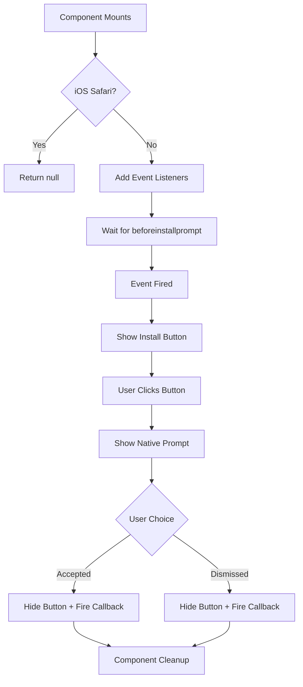

# InstallPWAButton Component

A reusable React component for Next.js App Router that provides a user-friendly PWA installation experience with full TypeScript support and cross-browser compatibility.

## ✨ Features

- **🎯 Smart Event Handling**: Automatically captures and manages `beforeinstallprompt` events
- **📱 Cross-Platform Support**: Works on Chrome, Edge, Firefox, and Samsung Internet
- **🍎 iOS Safari Graceful Degradation**: Handles unsupported browsers elegantly
- **⚡ TypeScript Ready**: Full type safety with custom event interfaces
- **🎨 Customizable**: Flexible styling and text options
- **♿ Accessible**: ARIA labels and keyboard navigation support
- **🧹 Self-Cleaning**: Automatic event cleanup and state management

## 🚀 Quick Start

### Basic Usage

```tsx
import InstallPWAButton from './components/InstallPWAButton';

export default function MyPage() {
  return (
    <div>
      <h1>My PWA App</h1>
      <InstallPWAButton />
    </div>
  );
}
```

### With Custom Options

```tsx
<InstallPWAButton 
  buttonText="📱 Install App"
  className="my-custom-styles"
  onInstallPromptHandled={(outcome) => {
    if (outcome === 'accepted') {
      // Track successful installation
      analytics.track('pwa_installed');
    }
  }}
/>
```

## 📋 Props API

| Prop | Type | Default | Description |
|------|------|---------|-------------|
| `buttonText` | `string` | `"Install App"` | Text displayed on the install button |
| `className` | `string` | `""` | Additional CSS classes for custom styling |
| `onInstallPromptHandled` | `(outcome: 'accepted' \| 'dismissed') => void` | `undefined` | Callback fired after user responds to install prompt |

## 🎨 Styling

The component uses Tailwind CSS classes but can be customized:

### Default Styles
```tsx
// Built-in styles (Tailwind CSS)
"inline-flex items-center justify-center px-4 py-2 bg-blue-600 hover:bg-blue-700 text-white font-medium text-sm rounded-md shadow-sm transition-colors duration-200 focus:outline-none focus:ring-2 focus:ring-blue-500 focus:ring-offset-2"
```

### Custom Styling Examples

```tsx
// Minimal style
<InstallPWAButton className="bg-gray-800 text-white px-6 py-3 rounded-full" />

// Material Design style
<InstallPWAButton 
  className="bg-purple-600 hover:bg-purple-700 rounded-lg shadow-lg transform hover:scale-105 transition-all duration-200"
  buttonText="Get App"
/>

// Custom CSS
<InstallPWAButton className="custom-install-button" />
```

```css
/* Custom CSS */
.custom-install-button {
  background: linear-gradient(45deg, #667eea 0%, #764ba2 100%);
  border: none;
  border-radius: 8px;
  padding: 12px 24px;
  color: white;
  font-weight: 600;
  transition: transform 0.2s ease;
}

.custom-install-button:hover {
  transform: translateY(-2px);
  box-shadow: 0 4px 20px rgba(0,0,0,0.2);
}
```

## 🔧 Advanced Usage

### With Analytics Tracking

```tsx
import { useAnalytics } from './hooks/useAnalytics';

function MyApp() {
  const analytics = useAnalytics();
  
  return (
    <InstallPWAButton 
      onInstallPromptHandled={(outcome) => {
        analytics.track('pwa_install_prompt', {
          outcome,
          timestamp: new Date().toISOString(),
          userAgent: navigator.userAgent
        });
        
        if (outcome === 'accepted') {
          // Show success message
          toast.success('App installed successfully! 🎉');
        }
      }}
    />
  );
}
```

### With State Management

```tsx
import { useState } from 'react';

function MyComponent() {
  const [installStatus, setInstallStatus] = useState<'pending' | 'installed' | 'dismissed'>('pending');
  
  return (
    <div>
      {installStatus === 'installed' && (
        <div className="success-message">
          ✅ App successfully installed!
        </div>
      )}
      
      <InstallPWAButton 
        onInstallPromptHandled={(outcome) => {
          setInstallStatus(outcome === 'accepted' ? 'installed' : 'dismissed');
        }}
      />
    </div>
  );
}
```

### Multiple Instances (Different Pages)

```tsx
// Header component
<InstallPWAButton 
  buttonText="Install"
  className="text-sm px-3 py-1"
/>

// Hero section
<InstallPWAButton 
  buttonText="📱 Get the App"
  className="text-lg px-8 py-4 bg-gradient-to-r from-blue-600 to-purple-600"
/>

// Footer
<InstallPWAButton 
  buttonText="Install App"
  className="text-xs bg-gray-600"
/>
```

## 🌍 Browser Support

| Browser | Support | Notes |
|---------|---------|-------|
| Chrome (Desktop) | ✅ Full | Native `beforeinstallprompt` support |
| Chrome (Android) | ✅ Full | Native support with home screen integration |
| Edge | ✅ Full | Native support |
| Firefox | ✅ Full | Native support (Firefox 85+) |
| Samsung Internet | ✅ Full | Native support |
| Safari (iOS) | ⚠️ Limited | No `beforeinstallprompt` - component returns `null` |
| Safari (macOS) | ⚠️ Limited | Manual "Add to Dock" only |

## 🔄 Component Lifecycle



## 🎯 Best Practices

### 1. **Placement Strategy**
```tsx
// ✅ Good - Header/navigation area
<header>
  <nav>...</nav>
  <InstallPWAButton className="ml-auto" />
</header>

// ✅ Good - Hero section call-to-action
<section className="hero">
  <h1>Welcome to Our App</h1>
  <InstallPWAButton buttonText="📱 Install Now" />
</section>

// ❌ Avoid - Footer only (users might miss it)
```

### 2. **User Experience**
```tsx
// ✅ Good - Clear, action-oriented text
<InstallPWAButton buttonText="📱 Install App" />
<InstallPWAButton buttonText="Get Desktop App" />

// ❌ Avoid - Vague or technical terms
<InstallPWAButton buttonText="Add to Home Screen" />
<InstallPWAButton buttonText="Install PWA" />
```

### 3. **Analytics & Tracking**
```tsx
// ✅ Good - Track both outcomes
<InstallPWAButton 
  onInstallPromptHandled={(outcome) => {
    analytics.track('pwa_install_attempt', { outcome });
    
    if (outcome === 'accepted') {
      // Track successful installs
      analytics.track('pwa_install_success');
    } else {
      // Track dismissals for optimization
      analytics.track('pwa_install_dismissed');
    }
  }}
/>
```

## 🐛 Troubleshooting

### Button Not Appearing

1. **Check PWA Requirements**:
   - Manifest file properly configured
   - Service worker registered
   - HTTPS enabled (or localhost)
   - All PWA criteria met

2. **Browser Support**:
   - Test in Chrome/Edge (best support)
   - Check browser console for errors
   - Verify `beforeinstallprompt` event fires

3. **Component Issues**:
   - Ensure component is client-side (`'use client'`)
   - Check for JavaScript errors
   - Verify Tailwind CSS is configured

### Install Prompt Not Working

```tsx
// Debug with additional logging
<InstallPWAButton 
  onInstallPromptHandled={(outcome) => {
    console.log('Install prompt result:', outcome);
    console.log('Timestamp:', new Date().toISOString());
    console.log('User agent:', navigator.userAgent);
  }}
/>
```

### Styling Issues

```tsx
// Override default styles if needed
<InstallPWAButton 
  className="!bg-red-500 !text-white !px-6 !py-3"
  buttonText="Custom Install"
/>
```

## 🧪 Testing

### Manual Testing Checklist

- [ ] Button appears when PWA criteria are met
- [ ] Button disappears on iOS Safari
- [ ] Install prompt shows when clicked
- [ ] Button disappears after prompt is used
- [ ] Callback fires with correct outcome
- [ ] App installs successfully
- [ ] Component cleans up properly

### Automated Testing

```tsx
// Jest + React Testing Library example
import { render, screen, fireEvent, waitFor } from '@testing-library/react';
import InstallPWAButton from './InstallPWAButton';

// Mock the beforeinstallprompt event
const mockPromptEvent = {
  preventDefault: jest.fn(),
  prompt: jest.fn().mockResolvedValue(undefined),
  userChoice: Promise.resolve({ outcome: 'accepted', platform: 'web' })
};

test('shows install button when prompt is available', async () => {
  render(<InstallPWAButton />);
  
  // Simulate beforeinstallprompt event
  fireEvent(window, new CustomEvent('beforeinstallprompt', { detail: mockPromptEvent }));
  
  await waitFor(() => {
    expect(screen.getByRole('button', { name: /install app/i })).toBeInTheDocument();
  });
});
```

## 📚 Additional Resources

- [PWA Install Criteria](https://web.dev/install-criteria/)
- [beforeinstallprompt Event](https://developer.mozilla.org/en-US/docs/Web/API/BeforeInstallPromptEvent)
- [PWA Best Practices](https://web.dev/pwa-checklist/)
- [Web App Manifests](https://web.dev/add-manifest/)

---

**Need help?** Check the browser console for debug logs when the component loads and when install events occur. 